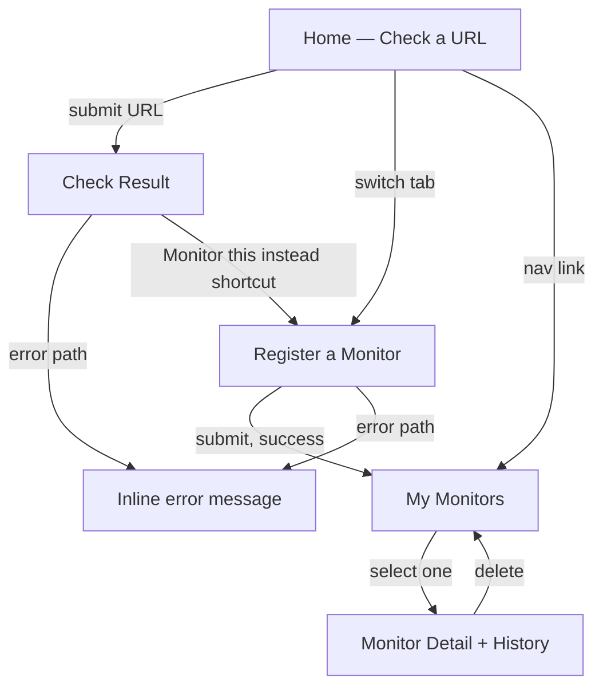
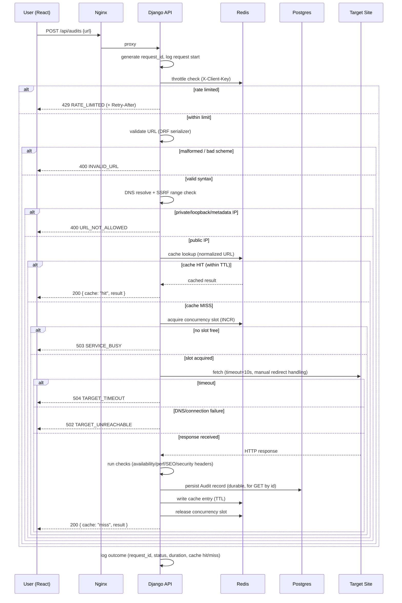
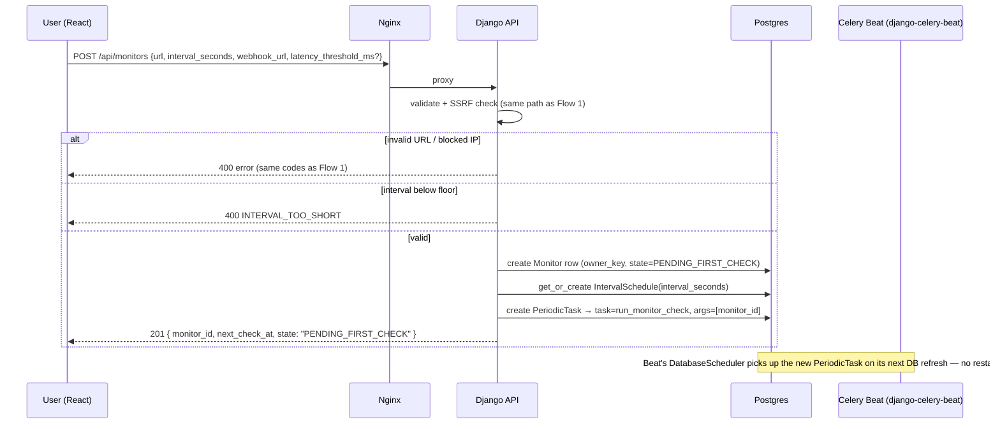
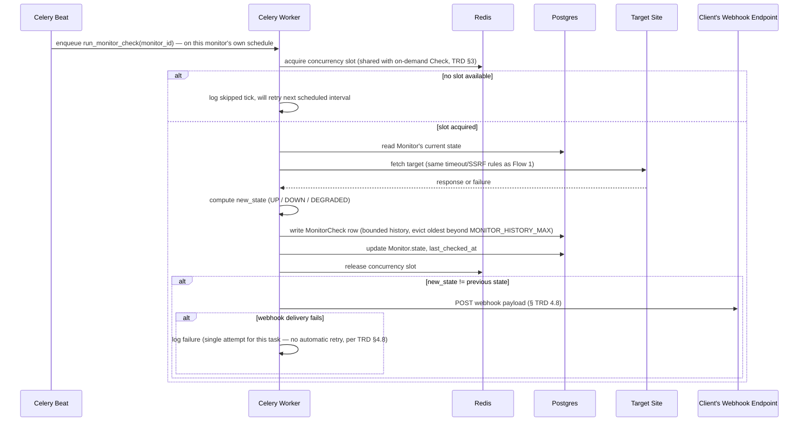
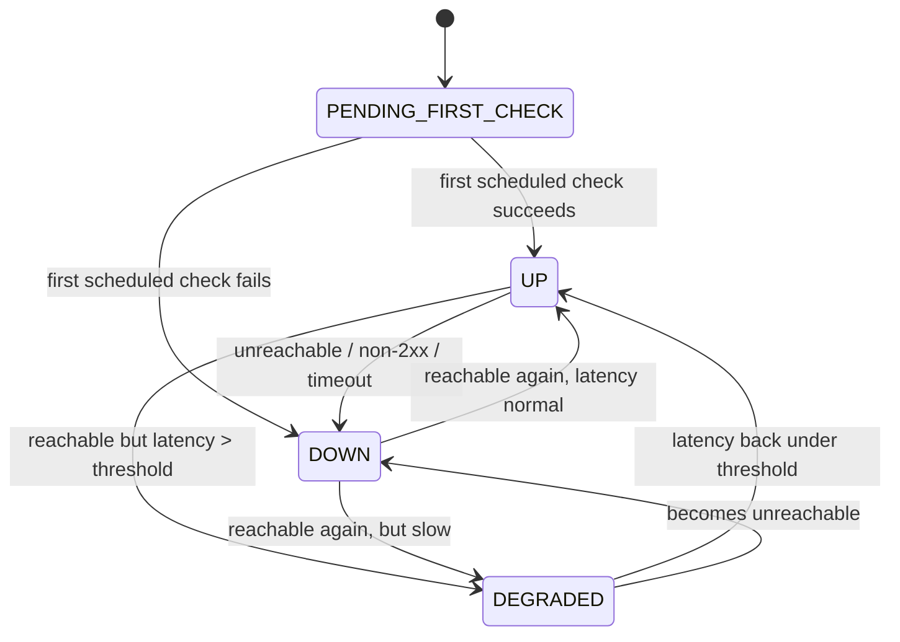
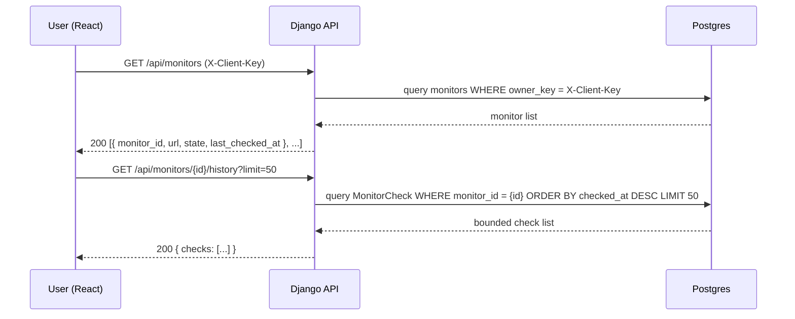
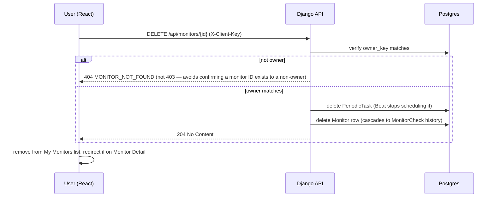

# App Flow Document

## PulseWatch
**Digital Heroes SDE Qualification Task — Task A (Production Build) + Task B (Scale Design)**

| | |
|---|---|
| **Doc** | 3 of 6 — App Flow |
| **Version** | 1.0 |
| **Status** | Draft for Review |
| **Traces to** | PRD v3.0, TRD v2.1 |
| **Next docs** | UI/UX Brief → Backend Schema → Implementation Plan |

---

## 0. Purpose

This doc maps the actual **request and user journeys** — what happens, in what order, across which components — for both flows shipping in code: **Check** (on-demand) and **Monitor** (register + scheduled recurring checks + alert). Visual design (wireframes, layout, copy) is the next doc's job; this one is about sequence and state, not pixels.

---

## 0.1 Open Design Decision — Resolved Here: Anonymous Monitor Ownership

**The PRD/TRD never specified auth (no login, no accounts — consistent with the "single-page web UI" Must-have scope).** That's fine for Check, which is stateless per-request. But Monitor introduces a "my monitors" concept — something needs to scope which monitors belong to which visitor without building a full auth system.

**Resolution:** reuse the same lightweight client identification already needed for rate limiting (TRD §8).

- On first visit, the React app generates a random client token (UUID), stores it in `localStorage`
- Every request — Check or Monitor — sends it as `X-Client-Key` header
- TRD §8's throttle key and Monitor's `owner_key` (new column, flagged for Backend Schema) are **the same value** — one mechanism serving two purposes, not two systems bolted together
- No login, no password, no account recovery — if `localStorage` is cleared, that visitor's monitors become inaccessible (acceptable for this task's scope; a real product would tie this to actual accounts, per PRD §4.5 Phase 4)

This is called out explicitly because it changes the API contract slightly (an added header) and the schema (an added column) — confirm before Backend Schema locks it in.

---

## 1. Page / Screen Map (navigation only — visuals in next doc)

Five screens total: **Home**, **Check Result**, **Register a Monitor**, **My Monitors** (list), **Monitor Detail**. `ErrorState` isn't a separate route — it's an inline state on whichever screen the error occurred on (detailed in the UI/UX Brief).

---

## 2. Flow 1 — On-Demand Check (happy + error paths)

*Implements FR-1 through FR-8.*

**Design clarification carried to Backend Schema:** Audit results are **persisted to Postgres** (durable record, supports `GET /api/audits/{id}` and any future history feature) **in addition to** the Redis cache entry (fast-path, TTL-bound, exists purely to satisfy FR-5/6's "don't re-fetch" requirement). Redis and Postgres are doing different jobs here, not duplicating one.

### 2.1 User-facing states on the Home/Result screen
1. **Idle** — empty input, waiting for submission
2. **Loading** — request in flight (spinner; if it's taking a while, this is expected up to the ~10s fetch timeout)
3. **Result — success** — full breakdown shown, with a visible "served from cache" badge when `cache: "hit"`
4. **Result — error** — one of the error codes in TRD §5, shown as a specific, human-readable message (not a generic "something went wrong") with a retry action where retrying makes sense (timeout, busy) and no retry action where it won't help (invalid URL — fix the input instead)

---

## 3. Flow 2 — Register a Monitor

*Implements FR-11.*

User is redirected to **My Monitors** on success, where the new monitor shows `PENDING_FIRST_CHECK` until its first scheduled run completes.

---

## 4. Flow 3 — Scheduled Check (system-triggered, no user present)

*Implements FR-12, FR-13. This is the flow that actually justifies Celery/Redis/Postgres as "the queueing strategy" for Task B.*

**Note:** scheduled checks always fetch fresh — they intentionally skip the Redis cache lookup that on-demand Checks use, because the whole point of Monitor is to know the *current* state, not a 15-minute-old cached one.

---

## 5. State Machine — Monitor Status

*Implements FR-13's "state transition" trigger condition.*

**Webhook fires on every arrow above except the initial `[*] → PENDING_FIRST_CHECK`** (nothing to notify about yet — there's no "previous state" to compare against). `PENDING_FIRST_CHECK → UP` **does** fire, since a client waiting on their very first result should still get notified as soon as it resolves, not just on later flips.

---

## 6. Flow 4 — Viewing Monitor Status & History

*Implements FR-14. Pure read flow, no state change.*

`GET /api/monitors` (list) wasn't explicit in the TRD's endpoint table — flagging it here since "My Monitors" screen needs it. **Adding it to the API contract as a small addition, confirm before Backend Schema.**

---

## 7. Flow 5 — Deleting a Monitor

**Deliberate choice:** `404` rather than `403` for a non-owner's delete attempt — this is a small but real security-posture decision (don't leak existence of a resource to someone who can't act on it), worth a one-line mention in the Task B failure-mode/security notes.

---

## 8. Cross-Cutting Concerns

### 8.1 Request ID propagation
Every flow above logs the same `request_id` (or, for Flow 3, a task-generated equivalent) from entry to exit — this is what makes TRD §9's structured logging actually useful for debugging a specific failed request rather than grepping through unstructured noise.

### 8.2 Error display consistency
Every error code in TRD §5 maps to exactly one user-facing message, defined once (in the UI/UX Brief, next doc) and reused everywhere that code can occur — Check and Monitor registration share the same `400 INVALID_URL` message, for example, since it's the same underlying validation.

### 8.3 Loading & retry semantics
- **Retryable** (user should be offered a retry action): `504 TARGET_TIMEOUT`, `502 TARGET_UNREACHABLE`, `503 SERVICE_BUSY`, `429 RATE_LIMITED` (with the `Retry-After` value informing when retry becomes useful)
- **Not retryable without changing input**: `400 INVALID_URL`, `400 URL_NOT_ALLOWED`, `400 INTERVAL_TOO_SHORT` — retrying the identical request will fail identically

### 8.4 Cache visibility
Flow 1's `cache: "hit" | "miss"` flag isn't just internal plumbing — it's surfaced in the UI (a small badge) so the caching requirement (20% of the rubric) is *visibly demonstrable* to an evaluator clicking around the live site, not just provable by reading logs.

---

## 9. Flow → Requirement Traceability

| Flow | FRs Implemented | Rubric Criterion Served |
|---|---|---|
| 1 — On-Demand Check | FR-1–FR-8 | Correctness/resilience (30%), Caching/rate limiting (20%) |
| 2 — Register Monitor | FR-11 | Code quality — reuses Flow 1's validation/SSRF path |
| 3 — Scheduled Check | FR-12, FR-13 | Correctness/resilience — same rigor as Flow 1, background context |
| 4 — Status & History | FR-14 | — |
| 5 — Delete Monitor | (supporting) | Code quality/security posture |

---

## 10. Confirmed

1. **`X-Client-Key` anonymous-ownership approach (§0.1) — confirmed.** No auth/accounts for this task; TRD updated with the header mechanism, `Monitor.owner_key`, and the new `CLIENT_KEY_REQUIRED` error code.
2. **`GET /api/monitors` (list) — confirmed, added to TRD §4.4a.**
3. **`404`-not-`403` on unauthorized delete (§7) — confirmed, reflected in TRD §4.7.**

Next: the **UI/UX Brief** turns the five screens in §1 into actual layout, component, and interaction detail.
