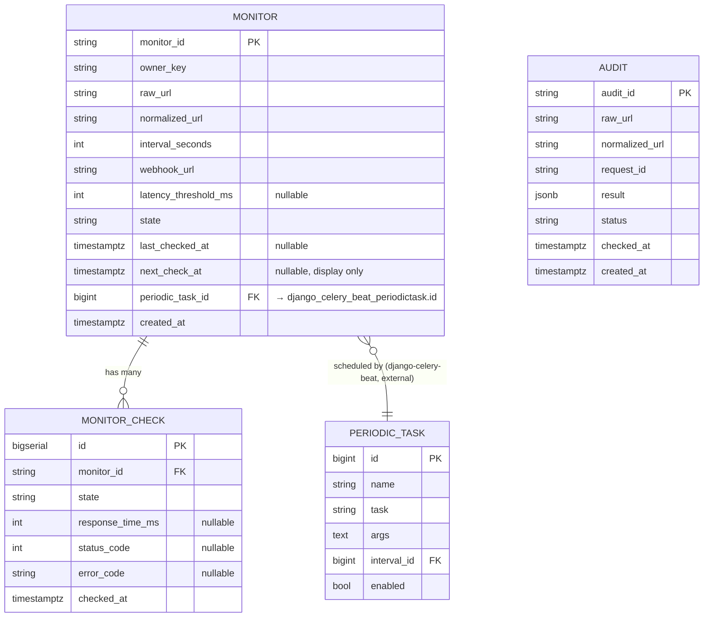

# Backend Schema

## PulseWatch
**Digital Heroes SDE Qualification Task — Task A (Production Build) + Task B (Scale Design)**

| | |
|---|---|
| **Doc** | 5 of 6 — Backend Schema |
| **Version** | 1.0 |
| **Status** | Draft for Review |
| **Traces to** | TRD v2.1, App Flow v1.1 |
| **Next doc** | Implementation Plan |

---

## 0. Purpose

Defines the actual Postgres tables and Redis key structure everything in the App Flow and UI/UX docs reads from and writes to. Two storage systems, two different jobs — this doc is also where that split gets made explicit and permanent, not just a design note in the TRD.

- **Postgres** — durable record: every completed Audit, every Monitor's config, every historical MonitorCheck
- **Redis** — ephemeral/fast: the Audit cache (TTL-bound), rate-limit counters, and the concurrency gate

---

## 1. Entity Relationship Diagram



`PERIODIC_TASK` (and `IntervalSchedule`, not shown) are **owned by `django-celery-beat`'s own migrations** — not app models, no app-level foreign key constraint on them (Django can't easily FK into another app's dynamically-migrated tables cleanly in all versions). `Monitor.periodic_task_id` is stored as a plain integer reference, resolved via `django_celery_beat.models.PeriodicTask.objects.get(id=...)` in application code, not enforced at the DB constraint level. This is a deliberate, documented exception to "everything has a real FK" — flagging it so it doesn't look like an oversight.

---

## 2. Table: `audits`

Durable record of every completed Check (Flow 1). Exists so `GET /api/audits/{id}` works even after the Redis cache entry expires, and so a Phase-2 "audit history" feature (PRD §4.5) has data to build on without a schema change.

| Column | Type | Constraints | Notes |
|---|---|---|---|
| `audit_id` | `varchar(32)` | PK | `"aud_" + secrets.token_hex(8)` — generated in application code, not a DB sequence |
| `raw_url` | `text` | not null | Exactly as submitted, pre-normalization — useful for debugging "why did this get flagged" |
| `normalized_url` | `varchar(2048)` | not null, indexed | Lowercased host, stripped default port, sorted query params, trailing slash normalized — the actual cache/lookup key |
| `request_id` | `varchar(64)` | not null | Correlates to the structured log line (TRD §9) |
| `result` | `jsonb` | not null | The full `result` object from the API contract (TRD §4.1) — availability/performance/seo_signals/security_headers |
| `status` | `varchar(16)` | not null | `completed` \| `failed` — a failed audit still gets a row, with `result` holding the error detail, so nothing about a request vanishes silently |
| `checked_at` | `timestamptz` | not null | When the check actually ran |
| `created_at` | `timestamptz` | not null, default now() | Row insert time — same as `checked_at` in practice, kept separate for consistency with other tables |

**Indexes:** `idx_audits_normalized_url` (btree on `normalized_url`), `idx_audits_created_at` (btree, descending — supports any future "recent audits" listing without a new migration).

**Not indexed/enforced:** no uniqueness constraint on `normalized_url` — repeated checks of the same URL create multiple rows over time by design (each is a point-in-time record); Redis, not a DB constraint, is what prevents redundant *fetches* within the TTL window.

---

## 3. Table: `monitors`

| Column | Type | Constraints | Notes |
|---|---|---|---|
| `monitor_id` | `varchar(32)` | PK | `"mon_" + secrets.token_hex(8)` |
| `owner_key` | `varchar(64)` | not null, indexed | The `X-Client-Key` header value (App Flow §0.1) — no FK to a users table, since none exists |
| `raw_url` | `text` | not null | As submitted |
| `normalized_url` | `varchar(2048)` | not null | Same normalization as Audit |
| `interval_seconds` | `integer` | not null, check `>= 60` | Mirrors `MONITOR_MIN_INTERVAL_SECONDS`; the check constraint is a DB-level backstop behind the API/UI validation, not a replacement for it |
| `webhook_url` | `text` | not null | Alert destination |
| `latency_threshold_ms` | `integer` | nullable | `NULL` = no latency-based `DEGRADED` check, only up/down |
| `state` | `varchar(24)` | not null, default `'PENDING_FIRST_CHECK'` | One of the state machine values (App Flow §5) |
| `last_checked_at` | `timestamptz` | nullable | `NULL` until the first scheduled check runs |
| `next_check_at` | `timestamptz` | nullable | **Display-only estimate** (`last_checked_at + interval_seconds`), recalculated after every check. Not authoritative — the real schedule lives in `django-celery-beat`'s tables. Exists purely so the API/UI don't need to join into Celery's internal schema just to show "next check ~10:25 UTC" |
| `periodic_task_id` | `integer` | nullable | Points to `django_celery_beat_periodictask.id`; used on delete to locate and remove the schedule (App Flow §7) |
| `created_at` | `timestamptz` | not null, default now() | |

**Indexes:** `idx_monitors_owner_key` (btree — every `GET /api/monitors` list query filters on this), `idx_monitors_normalized_url` (supports a possible future "is anyone already monitoring this?" check).

**Constraint:** `unique(owner_key, normalized_url)` — one active monitor per (client, URL) pair. Prevents someone accidentally double-clicking "Start Monitoring" and ending up with two schedules hammering the same target. If a genuine "monitor the same URL twice with different settings" need ever comes up, that's a deliberate schema change later, not an accident now.

---

## 4. Table: `monitor_checks`

The bounded history behind `GET /api/monitors/{id}/history` (FR-14).

| Column | Type | Constraints | Notes |
|---|---|---|---|
| `id` | `bigserial` | PK | Simple auto-increment — no need for a prefixed public ID, these are never referenced individually via the API, only listed |
| `monitor_id` | `varchar(32)` | FK → `monitors.monitor_id`, `ON DELETE CASCADE`, not null | Deleting a Monitor deletes its history — matches App Flow §7's delete flow exactly, no orphaned rows |
| `state` | `varchar(24)` | not null | Snapshot of state *as of this check*, not a reference to the Monitor's current state |
| `response_time_ms` | `integer` | nullable | `NULL` when the check failed outright (timeout/unreachable) rather than succeeded-but-slow |
| `status_code` | `integer` | nullable | `NULL` on total unreachability (no response to have a status code) |
| `error_code` | `varchar(32)` | nullable | One of the TRD §5 codes, populated only on a failed check |
| `checked_at` | `timestamptz` | not null | |

**Index:** `idx_monitor_checks_monitor_id_checked_at` — composite btree on `(monitor_id, checked_at DESC)`. This is the single most important index in the schema — every history read is `WHERE monitor_id = ? ORDER BY checked_at DESC LIMIT 50`, and without this composite index that query degrades badly once a popular monitor accumulates thousands of rows.

### 4.1 Retention / Pruning — bounded in storage, not just in API response

FR-14 says "bounded history," and the TRD's `MONITOR_HISTORY_MAX` (default 50) shouldn't just be a `LIMIT` clause papering over an unbounded table. **After every insert**, the same transaction prunes rows beyond the max for that monitor:

```sql
DELETE FROM monitor_checks
WHERE monitor_id = %(monitor_id)s
  AND id NOT IN (
    SELECT id FROM monitor_checks
    WHERE monitor_id = %(monitor_id)s
    ORDER BY checked_at DESC
    LIMIT %(max)s
  );
```

This keeps per-monitor storage flat regardless of how long a monitor has existed — relevant at Task B's 10K/day scale, where unbounded history growth would otherwise be one of the first things to bite (worth a line in the Task B Failure Mode Analysis: "unbounded table growth" as a risk, "prune-on-write" as the mitigation, already implemented here rather than deferred).

---

## 5. Redis Key Schema

Redis is doing three unrelated jobs (§0) — namespacing keys clearly matters so they're not accidentally confusable or overwritten.

| Key Pattern | Type | TTL | Purpose |
|---|---|---|---|
| `cache:audit:{normalized_url}` | String (JSON) | `CACHE_TTL_SECONDS` (default 900s) | FR-5/6 — the Audit result cache |
| `throttle:{client_key}` | Managed by DRF's throttle class internals | Rolling window | Rate limiting (TRD §8) — not hand-designed here, DRF/`django-redis` owns the internal shape |
| `concurrency:active_checks` | Sorted Set | Self-pruning (see below) | Concurrency gate (TRD §3) |

### 5.1 Concurrency gate — sorted set, not a plain counter

A plain `INCR`/`DECR` counter has a real failure mode: if a worker process crashes *between* acquiring a slot and releasing it (e.g., an unhandled exception during the outbound fetch, or the container gets OOM-killed), the counter never decrements — the slot leaks permanently, and the service's effective concurrency limit silently shrinks over time until it hits zero and everything returns `503`.

**Design:** a Redis Sorted Set (`ZADD`/`ZREM`/`ZCARD`), member = `request_id` (or `monitor_id:check_timestamp` for scheduled checks), score = acquisition timestamp.

- **Acquire:** `ZREMRANGEBYSCORE concurrency:active_checks -inf (now - 2*FETCH_TIMEOUT_SECONDS)` (prune anything stale first — self-healing against the crash scenario above) → `ZCARD` → if `< MAX_CONCURRENT_CHECKS`, `ZADD concurrency:active_checks {now} {request_id}` and proceed; else `503 SERVICE_BUSY`
- **Release:** `ZREM concurrency:active_checks {request_id}` on completion (success or handled error)

This means a crashed request's slot is reclaimed automatically within `2 * FETCH_TIMEOUT_SECONDS`, not held forever — a small design choice that directly strengthens the "resilience" criterion (30% weight) with a concrete, explainable answer to "what happens if a worker dies mid-check."

---

## 6. Django App/Model Notes

- `Audit`, `Monitor`, `MonitorCheck` as three straightforward Django models, one app (e.g., `checks/`)
- `django_celery_beat` added to `INSTALLED_APPS`, its own migrations run normally (`python manage.py migrate django_celery_beat`) — no custom model code needed for it, just configuration
- Primary keys (`audit_id`, `monitor_id`) generated in a model's `save()` override or a factory function at creation time — `varchar` PKs instead of Django's default auto-incrementing integer, chosen so IDs are non-guessable/non-enumerable (can't walk `mon_1`, `mon_2`, ... to discover other people's monitors) and so they're meaningful in logs/URLs at a glance
- `JSONField` (Postgres `jsonb`, native Django support) for `Audit.result` — no need for a separate normalized table per check dimension; the shape is read-heavy and rarely queried *inside* the JSON (no need for `result->'performance'->>'response_time_ms'` style queries in this task's scope)

---

## 7. Migration Ordering

1. `django_celery_beat`'s own migrations (external app)
2. App migration creating `audits`, `monitors`, `monitor_checks` — `monitors.periodic_task_id` has no DB-level FK constraint (§1), so migration order between the app and `django_celery_beat` doesn't create a dependency either way, but running `django_celery_beat` first is the conventional order

---

## 8. Sample Rows

**`audits`**
```
audit_id: aud_7c1e4d90
normalized_url: https://example.com/
result: {"availability": {...}, "performance": {...}, ...}
status: completed
checked_at: 2026-07-25 10:15:00+00
```

**`monitors`**
```
monitor_id: mon_5e6f7a8b
owner_key: 3f9a1c2e-...
normalized_url: https://example.com/
interval_seconds: 300
state: UP
last_checked_at: 2026-07-25 10:20:04+00
next_check_at: 2026-07-25 10:25:04+00   -- display estimate
periodic_task_id: 14
```

**`monitor_checks`** (most recent 3 of up to `MONITOR_HISTORY_MAX`)
```
monitor_id: mon_5e6f7a8b  state: UP    response_time_ms: 210  checked_at: 10:20:04
monitor_id: mon_5e6f7a8b  state: UP    response_time_ms: 198  checked_at: 10:15:04
monitor_id: mon_5e6f7a8b  state: DOWN  response_time_ms: NULL error_code: TARGET_TIMEOUT  checked_at: 10:10:04
```

---

## 9. Confirmed

1. **`unique(owner_key, normalized_url)` (§3)** — confirmed, one monitor per (client, URL) pair.
2. **Prune-on-write for `monitor_checks` (§4.1)** — confirmed, built in Task A code, not deferred to Task B description.
3. **Redis sorted-set concurrency gate (§5.1)** — confirmed, built in Task A code.

Next: the **Implementation Plan** sequences all five prior docs into an actual build order.
